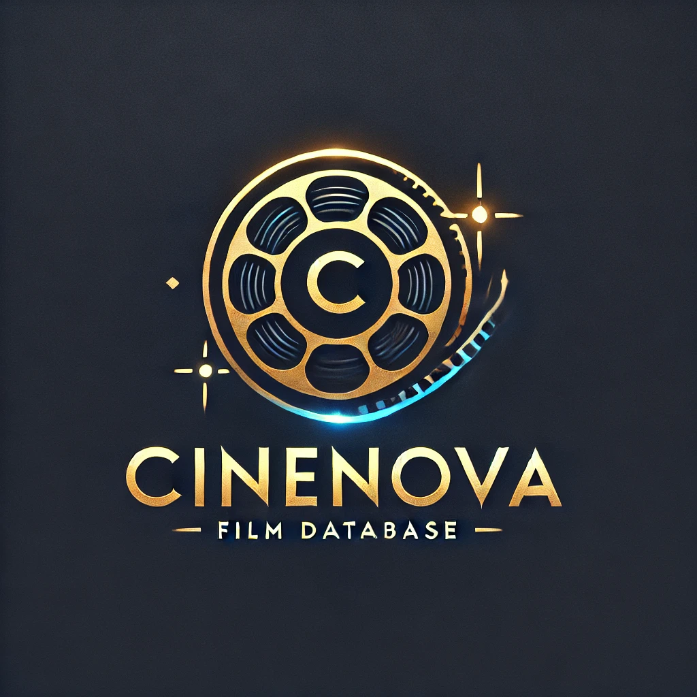

 # CineNova Film Database

> "Von Klassikern bis Blockbustern – CineNova bringt die Filmwelt zu dir!"

This is a simple film database that displays information about movies from the TMDB API. The project was built using **Vanilla TypeScript**, **Tailwind CSS**, and **Bun Vite**.

## Features

- **Search Movies:** Allows searching for movies based on title or year.
- **Movie Details:** Displays details such as title, year, genre, director, actors, ratings, and more.
- **Responsive Design:** The user interface is optimized for both desktop and mobile devices.

## Technologies

- **TypeScript:** For building the application.
- **Tailwind CSS:** For styling the user interface.
- **Bun Vite:** For bundling and development.
- **OMDb API:** For movie data.

